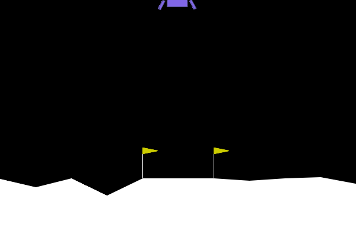
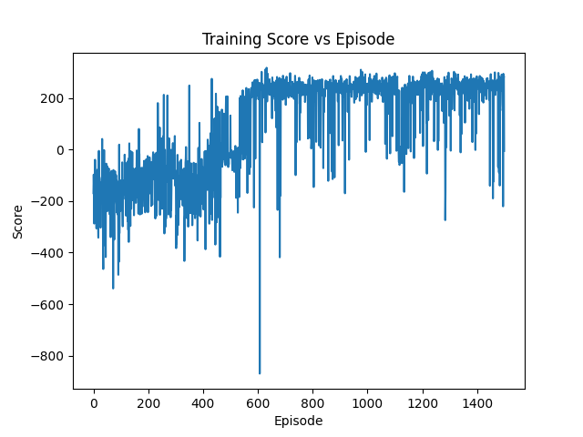

# AI Final Project

## Design:
The gymnaisum environment is LunarLander-v2, and the model trained is a Deep Q Network or DQN. 

## Required Packages:
- torch
- gymnasium
- random
- matplotlib
- numpy
- collections
- os
- pillow

## Files:

### Final_AI_proj.py:
The model code.

### lunar_lander.gif:
The gif of the training run, it only recorded 10 of the 1500 episodes.

### training_results.png:
A plot of the game score vs episode number.

### README.md:
This file. 

## To Run:
This project was trained and run in a pyhton virtual environment venv. To create your own, run 'python -m venv venv' in the project directory. After creating venv run 'source venv/bin/activate'. To run train a new model enter 'python Final_AI_proj.py' in the terminal. It may take a while to train because there are 1500 episodes. The code that saves the results plot, and the training gif, has been commented out for submission. That code will not overwrite the submitted training gif and results plot, but it will still show you the results plot from your training run. 
